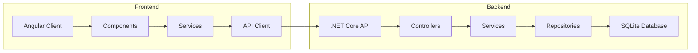

# Dating App

A modern dating application built with .NET Core Web API and Angular.

## Architecture



## Project Structure

### Backend (.NET Core Web API)
```
DatingApp/API/
├── Controllers/     # API endpoints
├── DTOs/           # Data Transfer Objects
├── Services/       # Business logic
├── Interfaces/     # Abstractions
├── Entities/       # Data models
├── Data/           # Database context
└── Program.cs      # Application entry point
```

### Frontend (Angular)
```
DatingApp/client/
├── src/
│   ├── app/        # Angular modules, components, services
│   ├── assets/     # Static assets
│   └── environments/ # Environment configs
└── angular.json    # Angular CLI config
```

## Getting Started

### Prerequisites
- .NET Core 6.0 or later
- Node.js 14.0 or later
- Angular CLI
- SQLite

### Backend Setup
1. Navigate to the API directory:
```bash
cd DatingApp/API
```

2. Restore dependencies:
```bash
dotnet restore
```

3. Run the application:
```bash
dotnet run
```

The API will be available at:
- https://localhost:5001
- http://localhost:5000

### Frontend Setup
1. Navigate to the client directory:
```bash
cd DatingApp/client
```

2. Install dependencies:
```bash
npm install
```

3. Start the development server:
```bash
ng serve
```

The client will be available at http://localhost:4200

## Features

- User authentication and authorization
- Profile management
- Matching system
- Real-time messaging
- Photo upload and management
- User preferences and settings

## API Documentation

The API documentation is available through Swagger UI at:
- https://localhost:5001/swagger
- http://localhost:5000/swagger

## Database

The application uses SQLite as its database. The database file is located at:
```
DatingApp/API/datingapp.db
```

## Security

- JWT (JSON Web Tokens) for authentication
- Password hashing using BCrypt
- HTTPS enabled
- CORS policy configured
- Input validation and sanitization

## Testing

### Backend Tests
```bash
cd DatingApp/API
dotnet test
```

### Frontend Tests
```bash
cd DatingApp/client
ng test
```

## Deployment

### Backend Deployment
1. Build the application:
```bash
dotnet publish -c Release
```

2. Deploy to your preferred hosting platform (Azure, AWS, etc.)

### Frontend Deployment
1. Build the production version:
```bash
ng build --prod
```

2. Deploy the contents of the `dist/` folder to your hosting service

## Contributing

1. Fork the repository
2. Create a feature branch
3. Commit your changes
4. Push to the branch
5. Create a Pull Request

